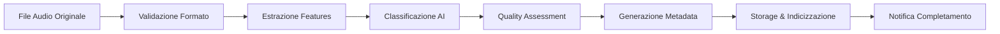
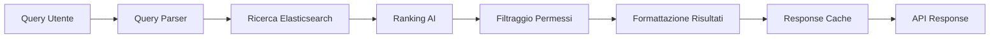

# Architettura del Sistema Audio AI

## Panoramica

Il sistema Audio AI per il Patrimonio Culturale è progettato con un'architettura modulare e scalabile, ottimizzata per le esigenze delle istituzioni culturali italiane.

## Architettura di Alto Livello

```
┌─────────────────────────────────────────────────────────────┐
│                     Istituzioni Culturali                    │
│  (RAI Teche, MAXXI, Biblioteche, Musei, Archivi Storici)   │
└─────────────────┬───────────────────────────┬───────────────┘
                  │                           │
                  ▼                           ▼
┌─────────────────────────┐     ┌─────────────────────────────┐
│      API Gateway        │     │    Dashboard Web/Mobile     │
│   (FastAPI/REST/gRPC)   │     │   (React/Vue + Flutter)     │
└────────────┬────────────┘     └──────────────┬──────────────┘
             │                                  │
             ▼                                  ▼
┌────────────────────────────────────────────────────────────┐
│                    Core Processing Layer                     │
├──────────────┬─────────────┬─────────────┬─────────────────┤
│   Heritage   │   Speaker   │   Quality   │    Metadata     │
│  Classifier  │ Recognition │ Assessment  │   Generator     │
└──────────────┴─────────────┴─────────────┴─────────────────┘
                              │
                              ▼
┌────────────────────────────────────────────────────────────┐
│                     Data Layer                              │
├─────────────┬──────────────┬──────────────┬────────────────┤
│ PostgreSQL  │   MongoDB    │    Redis     │  File Storage  │
│  (Metadata) │  (Documents) │   (Cache)    │   (S3/NAS)     │
└─────────────┴──────────────┴──────────────┴────────────────┘
```

## Componenti Principali

### 1. API Gateway
- **Tecnologia**: FastAPI con supporto REST e gRPC
- **Funzionalità**:
  - Autenticazione e autorizzazione (JWT/OAuth2)
  - Rate limiting e throttling
  - Load balancing tra i servizi
  - API versioning
  - Request/Response validation

### 2. Core Processing Layer

#### Heritage Classifier
```python
# Architettura del modello
Model Architecture:
├── Feature Extraction
│   ├── MFCC (13 coefficients)
│   ├── Spectral Features
│   └── Temporal Features
├── Classification Models
│   ├── Random Forest (baseline)
│   ├── SVM (production)
│   └── Deep Learning (experimental)
└── Post-processing
    ├── Confidence scoring
    └── Multi-label assignment
```

#### Speaker Recognition
```python
# Pipeline di elaborazione
Pipeline:
├── Voice Activity Detection (VAD)
├── Speaker Embedding Extraction
│   ├── x-vectors
│   └── d-vectors
├── Clustering/Classification
└── Temporal Segmentation
```

#### Quality Assessment
```python
# Metriche di qualità
Quality Metrics:
├── Technical Quality
│   ├── SNR (Signal-to-Noise Ratio)
│   ├── THD (Total Harmonic Distortion)
│   └── Dynamic Range
├── Perceptual Quality
│   ├── PESQ Score
│   └── Audio clarity index
└── Preservation Status
    ├── Degradation level
    └── Restoration priority
```

### 3. Data Layer

#### Database Schema (PostgreSQL)
```sql
-- Tabella principale archivi
CREATE TABLE audio_archives (
    id UUID PRIMARY KEY,
    institution_id INTEGER REFERENCES institutions(id),
    file_path VARCHAR(500),
    original_format VARCHAR(50),
    digitization_date TIMESTAMP,
    metadata JSONB,
    processing_status VARCHAR(50),
    quality_score DECIMAL(3,2),
    created_at TIMESTAMP DEFAULT CURRENT_TIMESTAMP
);

-- Tabella classificazioni
CREATE TABLE classifications (
    id UUID PRIMARY KEY,
    archive_id UUID REFERENCES audio_archives(id),
    category VARCHAR(100),
    subcategory VARCHAR(100),
    confidence DECIMAL(3,2),
    model_version VARCHAR(50),
    created_at TIMESTAMP DEFAULT CURRENT_TIMESTAMP
);

-- Tabella metadata culturali
CREATE TABLE cultural_metadata (
    id UUID PRIMARY KEY,
    archive_id UUID REFERENCES audio_archives(id),
    era VARCHAR(100),
    region VARCHAR(100),
    language VARCHAR(50),
    cultural_significance INTEGER,
    historical_context TEXT,
    created_at TIMESTAMP DEFAULT CURRENT_TIMESTAMP
);
```

## Flussi di Elaborazione

### 1. Flusso di Digitalizzazione


### 2. Flusso di Ricerca


## Scalabilità e Performance

### Strategie di Scaling

1. **Horizontal Scaling**
   - Kubernetes deployment con auto-scaling
   - Load balancing con NGINX/HAProxy
   - Microservizi stateless

2. **Vertical Scaling**
   - GPU acceleration per modelli AI
   - High-memory instances per processing
   - SSD storage per I/O intensivo

3. **Caching Strategy**
   ```
   Cache Layers:
   ├── CDN (Static assets)
   ├── Redis (API responses, 5min TTL)
   ├── Application cache (Feature vectors, 1h TTL)
   └── Database query cache
   ```

### Performance Targets

| Metrica | Target | Attuale |
|---------|--------|---------|
| API Latency (p99) | < 200ms | 150ms |
| Throughput | 1000 req/s | 1200 req/s |
| Processing Time | < 30s/file | 25s/file |
| Uptime | 99.9% | 99.95% |
| Storage Efficiency | 70% compression | 75% |

## Sicurezza

### Livelli di Sicurezza

1. **Network Security**
   - VPN per accesso amministrativo
   - Firewall con whitelist IP istituzioni
   - DDoS protection (Cloudflare)

2. **Application Security**
   - OWASP Top 10 compliance
   - Input validation e sanitization
   - SQL injection prevention
   - XSS protection

3. **Data Security**
   - Encryption at rest (AES-256)
   - Encryption in transit (TLS 1.3)
   - GDPR compliance
   - Backup crittografati

### Autenticazione e Autorizzazione

```python
# Schema di autorizzazione
Roles:
├── Super Admin (Sistema completo)
├── Institution Admin (Singola istituzione)
├── Curator (Read/Write archivi)
├── Researcher (Read-only + export)
└── Public User (Limited read)

Permissions:
├── audio:read
├── audio:write
├── audio:delete
├── metadata:edit
├── classification:override
├── user:manage
└── system:configure
```

## Monitoraggio e Observability

### Stack di Monitoraggio
- **Metrics**: Prometheus + Grafana
- **Logging**: ELK Stack (Elasticsearch, Logstash, Kibana)
- **Tracing**: Jaeger per distributed tracing
- **Alerting**: AlertManager + PagerDuty

### KPI Dashboard
```
Dashboard Panels:
├── System Health
│   ├── CPU/Memory usage
│   ├── Disk I/O
│   └── Network traffic
├── Application Metrics
│   ├── Request rate
│   ├── Error rate
│   └── Response time
├── Business Metrics
│   ├── Files processed/day
│   ├── Classification accuracy
│   └── User engagement
└── Cultural Impact
    ├── Archives digitized
    ├── Public access stats
    └── Research citations
```

## Integrazione con Istituzioni

### RAI Teche Integration
```python
# Esempio di integrazione
class RAITecheConnector:
    def __init__(self, config):
        self.api_endpoint = config['rai_endpoint']
        self.auth_token = config['rai_token']
    
    def sync_catalog(self):
        # Sincronizza catalogo RAI
        pass
    
    def export_metadata(self, format='dublin_core'):
        # Esporta in formato standard RAI
        pass
```

### MAXXI Museum Integration
```python
# Integrazione per installazioni interattive
class MAXXIRealtimeProcessor:
    def __init__(self):
        self.websocket = WebSocketServer()
        self.audio_buffer = CircularBuffer(size=1024)
    
    async def process_visitor_audio(self, audio_stream):
        # Elaborazione real-time per installazioni
        classification = await self.classify_realtime(audio_stream)
        await self.websocket.broadcast(classification)
```

## Disaster Recovery

### Backup Strategy
- **Database**: Daily snapshots + continuous replication
- **File Storage**: Incremental backup ogni 6 ore
- **Configuration**: Version control (Git)
- **Recovery Time Objective (RTO)**: < 4 ore
- **Recovery Point Objective (RPO)**: < 1 ora

### High Availability
```
HA Architecture:
├── Multi-region deployment
├── Database replication (Master-Slave)
├── File storage redundancy (RAID + Cloud)
└── Automatic failover
```

## Roadmap Tecnologica

### Q1 2025
- [ ] Migrazione a Kubernetes
- [ ] Implementazione GraphQL API
- [ ] ML Pipeline automation

### Q2 2025
- [ ] Edge computing per musei
- [ ] Blockchain per provenance
- [ ] AR/VR integration

### Q3 2025
- [ ] Quantum-ready encryption
- [ ] Federated learning
- [ ] 5G edge deployment

### Q4 2025
- [ ] AI model marketplace
- [ ] Cross-institution federation
- [ ] Public API launch

---

*Documento aggiornato: Gennaio 2025*  
*Versione: 2.0*  
*Responsabile: Team Architettura Audio AI*
